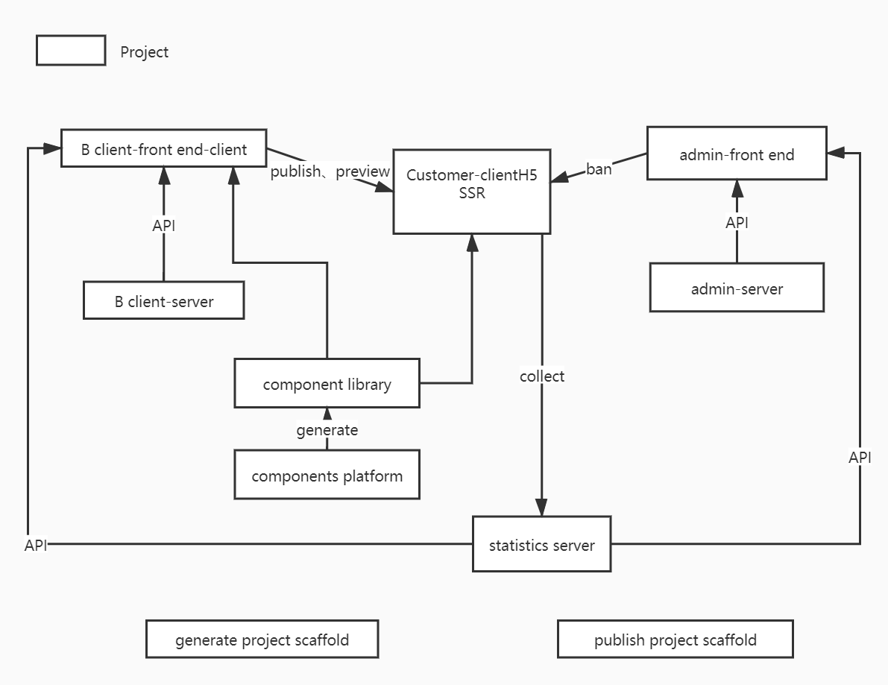

# 需求分析

|用户类型|功能|
|-------|---|
|图片创作者|注册，登陆，使用模板，保存，保存为模板，作品增删改，作品统计|
|管理员|用户增删改，作品增删改，作品统计，用户统计，流量统计，设置热门作品|
|运维人员|作品封禁，数据统计，作品管理，用户管理，模板管理|

# 范围

整体设计，架构设计

# 模块设计

|项目范围|项目|
|-------|---|
|B端|前端、后端|
|C端|SSR|
|管理端|前端、后端|
|开发|组件库、组件生成平台、项目生成脚手架、项目发布脚手架|



# 数据结构

## 1.作品vuex store 数据结构

1.1 state
```json5
{
  work: {
    title: "作品1",
    settings: {},
    props: {/*页面body的设置*/},
    currentComponentId: "xxx",
    components: [
      {
        id: "xxx",
        tag: "text",
        attrs: {
          value: "123",
          width: 12,
          height: 44,
          position: {
            x: 1,
            y: 1
          }
        },
        children: [
          "文本1"
        ]
      },
      {
        id: "xxx",
        tag: "img",
        attrs: {
          src: "url",
          width: 12,
          height: 44,
          position: {
            x: 1,
            y: 1
          }
        },
        children: null
      }
    ]
  }
}
```
1.2 getter
```js
{
    layers:(state) => {
        state.work.components.map(item =>({
            id: item.id,
            name: item.name    
        }))
    }
}
```

## 2.数据流转

# 扩展性保证

编辑器组件类型的扩展  
编辑器功能的扩展

# 开发提效

1.开发脚手架快速实现项目的创建与发布  
2.开发组件平台生成编辑器组件

# 运维保障

线上服务和运维服务  
安全  
监控和报警  
服务扩展性：流量大
