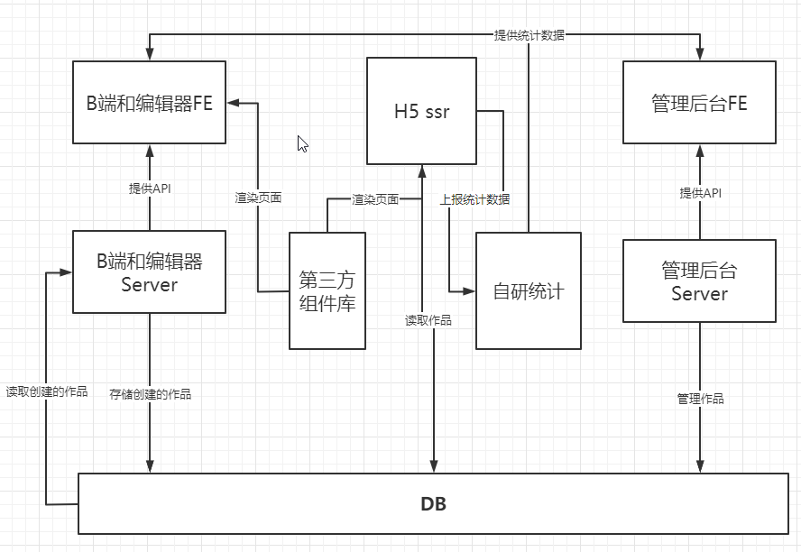
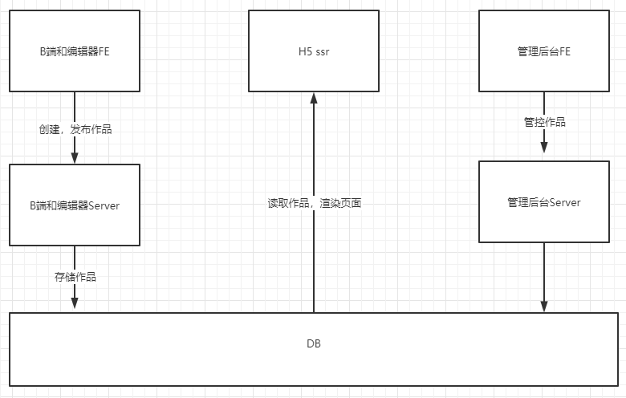

# 整体架构设计 V1.0

## 需求

- [需求文档](https://www.yuque.com/books/share/af79538c-09eb-4ddd-bfb7-599816c233bf)
- [慕课乐高体验地址](https://www.imooc-lego.com/)

## 模块设计

模块拆分: 

- B端和编辑器（前端，后端）
- H5（ssr）
- 管理后台（前端，后端）
- 第三方组件库：为了保证 编辑器和 h5 组件渲染的一致性
- 自研统计模块：为了满足项目个性化的统计需求

模块的关系图，关键功能及职责：



## 作品的数据结构

核心数据结构：

- 组件数据结构尽量复合 VNode 规范
- 用数组来组织数据，有序
- 尽量使用引用关系，避免冗余

```js
{
    // 作品
    work: {
        title: '作品标题',
        setting: { /* 拓展配置： 如配置渠道 */ },
        props: { /* 页面 body 的一些设置，如背景色 */ },
        components: [
            {
                id: 'xxx', // 每个组件都有 id ，不重复
                name: '文本1',
                tag: 'text',
                attrs: { fontSize: '20px' },
                children: [
                    '文本1' // 文本内容，有时候放在 children ，有时候放在 attrs 或者 props ，没有标准，看实际情况来确定
                ]
            },
            {
                id: 'yyy',
                name: '图片1',
                tag: 'image',
                attrs: { src: 'xxx.png', width: '100px' },
                children: null
            },
        ]
    },
    // 画布当前选中的组件
    activeComponentId: 'xxx'
}
```

数据流转关系图：

> B端将创建好的作品存入数据库；C端从数据库中读取创建的作品，渲染页面；管理后台可以管控作品的显示。



## 扩展性保证

- 数据结构层面
    - 页面级别的配置参数，如全局样式配置
    - 项目级别的配置参数，如提供分渠道统计的参数配置项
- 编辑器层面
    - 组件的扩展性，如组件隐藏，锁定及图层操作

## 开发提效

- 脚手架
    - 提供模板创建
    - CI/CD
- 组件平台
    - 组件库的创建，发布和预览

## 运维保障（待补充）

- 线上服务和运维服务
- 安全
- 监控和报警
- 服务扩展性：流量大
