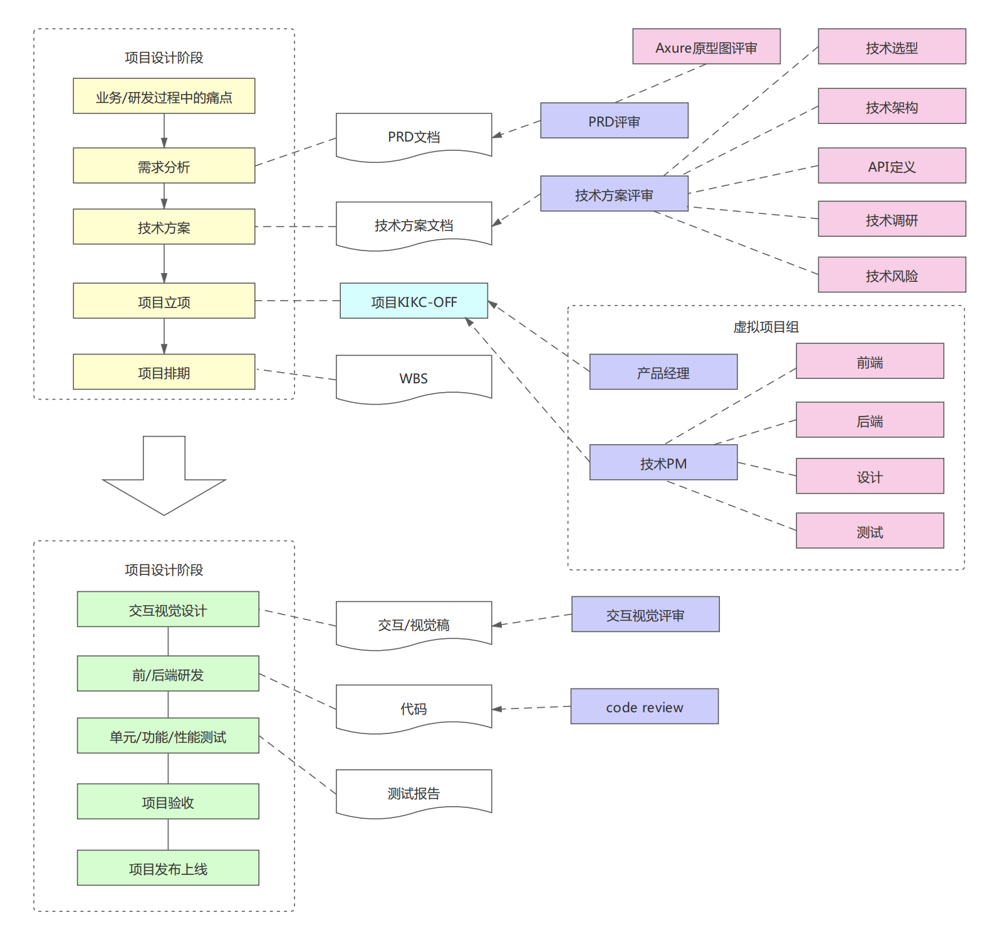
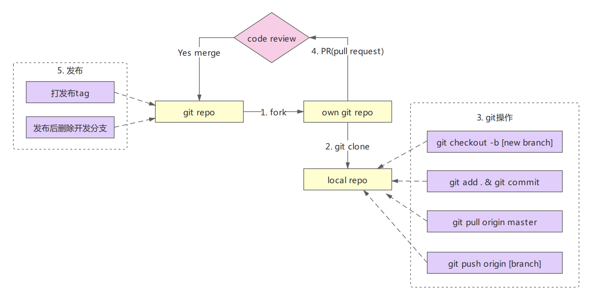
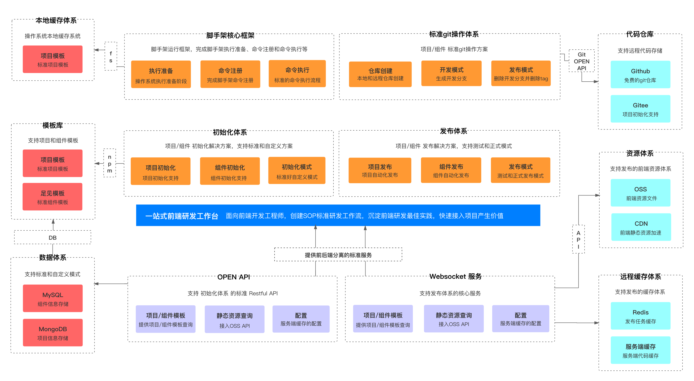
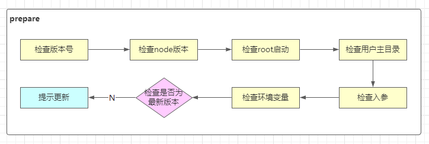
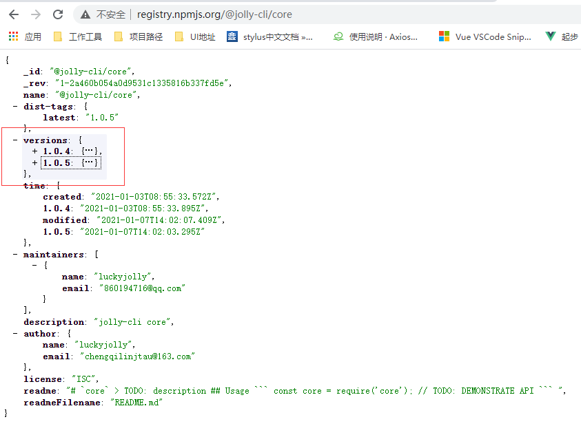

## 前导

### 收获

- 如何做架构设计和技术方案设计

- 脚手架核心流程，通过 commander 完成脚手架框架搭建
- 如何让Node项目支持ES Module

### 主要内容

- 脚手架需求分析和架构设计
- 脚手架模块拆分策略和core模块技术方案
- 脚手架执行准备过程实现
- 脚手架命令注册实现（基于commander 库）

### 作业

- 绘制 `imooc-cli` 脚手架架构设计图
- 实现 `imooc-cli` 脚手架准备过程代码
- 通过 commander 框架实现一个脚手架，包括自定义 option 和 command 功能
- 通过 webpack 和原生两种方式实现 Node 对ES Module 的支持

### 注意事项

- 本周前半部分偏架构设计，是架构师日常工作

- **架构师应该把整体和局部想清楚在开始做**

- 将代码实现细节抽象，通过系统论思想构建复杂系统：

  建立子系统，关注子系统的输入和输出是什么。然后由子系统构建较复杂的系统，再由较复杂的系统构建更复杂的系统。

## 脚手架整体架构设计

### 大厂怎么做项目

**设计阶段**

- 搞清楚业务或研发过程中的**痛点** -- 为什么有当前业务
- 由痛点形成需求
  - PD(产品) -> PRD文档（产品需求文档）
    - 原型图
    - 预期目标
  - PRD 评审
    - 原型图评审
- 技术方案设计阶段，产生技术方案文档。确定需求在技术上的实现，及确定技术方案实现成本
  - 技术选型
  - 技术架构 -> 架构设计
  - API定义
  - 技术调研
  - 评估技术风险
- 成本可接受，项目立项
  - kick-off（启动）
    - 确定项目成员：PD、PM(项目经理)、前端、后端、测试人员、设计等
- 项目排期（计划）
  - 时间点
  - WBS 文档（工作分解结构）

**实施阶段**

- 软件类项目，交互/视觉设计，输出设计稿
- 开发，输出代码
  - 前后端开发
  - 联调

- 测试，输出测试报告
  - 单元测试（开发人员）
  - 功能测试（测试人员）
  - 性能测试（测试人员）

- 交给产品或业务人员验收
  - 微调
- 上线



### 痛点

- 创建项目/组件时，重复代码问题
- 协同开发时，git操作不规范问题
- 发布上线耗时，且容易出错问题

### 需求分析

- 通用的研发脚手架
- 通用的项目/组件创建能力
  - 模块支持定制；定制后能快速生效
  - 模板支持快速接入，极低的接入成本
- 通用的项目/组件发布能力
  - 发布过程自动完成标准的git操作
  - 发布成功后自动删除开发分支并创建tag
  - 发布后自动完成云构建、OSS(静态资源服务器)上传、CDN上传、域名绑定
  - 发布过程中支持测试/正式两种模式

### 大厂git操作规范

**分支管理**

- master

  不会再次基础上开发，仅用作代码同步：上线时，将 dev/0.0.1 push到master上，进行 merge 然后打上 release/0.0.1 tag

- dev 开发

  - ~~dev/0.0.1~~
  - dev/0.0.2

- release 发布

  - release/0.0.1 删除 dev/0.0.1

**git操作流程**



### `imooc-cli` 架构图

- 脚手架的核心架构
  - 脚手架初始化
  - 完成整个执行流程
    - 命令的执行
    - 异常的监听
    - ......
- 为什么需要后台 API
  - 实现通用能力
  - 接入外部项目
- webSocket 服务
  - 云构建
  - 云发布
- 静态资源
  - 组件构建结果
- 数据体系
  - MySQL 组件相关信息
  - MongoDB 项目模板



## 脚手架技术方案设计

### 脚手架拆包策略

参考 `lerna` 项目的拆包，根据模块的功能，将脚手架模块分为：

- 核心模块 -- core
- 命令 commands
  - 初始化
  - 发布
  - 清除缓存
- 模型层 models
  - Command 命令
  - Project 项目
  - Component 组件
  - Npm 模块
  - Git 仓库
- 支撑模块 utils
  - Git 操作
  - 云构建
  - 工具方法
  - API 请求
  - Git API

### core 模块技术方案

实现命令的执行流程

- 准备阶段

  

  - 检查root启动：避免权限问题。如果是root启动（mac root 用户登录），把权限降级到普通用户
  - 检查用户主目录：要往主目录写入缓存。设计**本地缓存体系**中的**本地文件**
  - 检查环境变量：本地缓存需要
  - 检查是否为最新版本：检查cli版本
  - 提示更新：更新cli

- 命令注册

- 命令执行

### 涉及技术点

**核心库**

- `import-local` 优先执行本地脚手架
- `commander` 实现命令注册

**用到的工具库**

- `npmlog` 打印日志
- `fs-extra` 文件操作。基于 `fs` 封装的
- `semver` 版本比对。检查当前版本是否为最新版本
- `colors` 控制终端文本颜色
- `user-home` 获取用户主目录
- `dotenv` 获取环境变量
- `root-check` root 账户检查和自动降级

## 脚手架执行准备过程实现

### `require()` 支持加载的资源类型

- `.js`

  必须使用 `module.exports`/`exports` 输出模块

- `.json`

  使用 `JSON.parse()` 方法对 `json` 文件进行解析，生成一个对象

- `.node`

  `.node` 文件是 `C++` 插件(`C++ AddOns`)，使用 `process.dlopen()` 打开

- `.any`

  当 `.js` 文件处理

  **使用 `require()` 加载一个内容为 `javascript` 代码的 `.txt` 文件，是可以执行成功的**

### `require()` 支持的路径

- 绝对路径
- 相对路径
- `node` 内置对象
- `node_modules` 中的包

### `npmlog`

- 只能调用 `log.addLevel()` 添加的方法，进行日志输出

  ```javascript
  log.addLevel('warn', 4000, { fg: 'black', bg: 'yellow' }, 'WARN')
  ```

- `log.level`

  默认 level 为 info 级(2000)。低于这个级别的日志，不会被打印

  ```javascript
  // default level
  log.level = 'info'
  // ……
  log.addLevel('verbose', 1000, { fg: 'blue', bg: 'black' }, 'verb')
  ```

  `log.verbose('test', 'msg')` 默认下，本调用的也不会打印

- `log.heading` 

  在 log 日志之前，添加前缀

  - 通过 `log.headingStyle` 定义样式

### 检查root启动

- `process.geteuid()` 

  - 返回 0， 代表超级管理员
  - 返回501，代表登录用户

- `root-check` 降级权限：

  ```javascript
  var rootCheck = require('root-check');
  rootCheck();
  ```

  - `process.env.SUDO_GID` 可以配置的登录用户分组id
  - `process.env.SUDO_UID` 可以配置的用户标识id

  - `process.setgid(gid)`  使用户所在的分组id

  - `process.setuid(uid)`  设置用户标识id

  - `defaultUid()` 返回平台的 用户标识

    ```javascript
    var DEFAULT_UIDS = {
      darwin: 501, // mac UNIX-like
      freebsd: 1000, // FreeBSD UNIX-like
      linux: 1000, 
      sunos: 100 // Solaris 系统
    }
    ```

### 检查用户主目录

- `path-exists` 检查文件是否存在
- `user-home` 获取用户主目录
- `os-homedir` 源码

### 检查入参

在 debug 模式下，使用 `log.verbose()` 打印日志。但`log.verbose()` 打印日志，正常状态下，是不能打印的。所以这里我们需要解析参数，判断是否是 debug 模式。

- `minimist` 库，解析参数。console：

  ``` bash
  args:  { _: [], debug: true }
  ```

- 参数解析之后，要修改 `log.LOG_LEVEL`；

### 检查环境变量

`dotenv` 获取环境变量

- 在用户主目录下创建 `.env` 文件存储和读取环境变量
- 默认路径：`path.resolve(process.cwd(), '.env')`  当前文件夹下的
- 从 `.env` 环境中获得的值，放在了 `process.env` 中

### 检查当前是否为最新版本

- 获取最新版本号和模块名

- 使用 npm API， 获取所有版本号

  网址 `仓库地址/npm包名 ` ，私有仓库也可以这样获取版本号

  - `http://registry.npmjs.org/@jolly-cli/core`
  - `http://registry.npm.taobao.org/@jolly-cli/core`

  

  使用的 chrome 插件 [JSONView](https://github.com/gildas-lormeau/JSONView-for-Chrome)

- 提取所有版本号，比对哪些版本号是大于当前版本号

- 获取最新版本号，提示用户更新到该版本

- **有个坑**

  ```bash
  lerna create get-npm-info ./utils/get-npm-info
  ```

  创建完包之后，包实际在 `core` 下面

  ```powershell
  lerna success create New package get-npm-info created at ./core\get-npm-info
  ```

- `url-join` 库，将多个 `url` 碎片，拼接生成完整 `url`。

### 遇到的问题总结

- `npm link` 报文件存在错误

  ```powershell
  File exists: D:\nodejs\nodejs\jolly-cli
  ```

  先 `npm unlink` 后，然后重新 `npm link`

- windows 系统上 `cli` 命令不能执行

  ```powershell
  jolly-cli : 无法加载文件 D:\nodejs\nodejs\jolly-cli.ps1，因为在此系统上禁止运行脚本。
  ```

  去根 `nodejs` 安装目录中删除 `.ps1` 后缀的文件，重新运行 `cli` 命令即可

