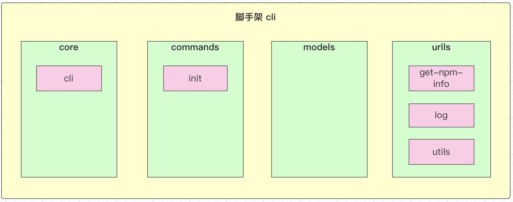

## 脚手架命令注册和执行过程开发

### 本周收获

- 如何设计高性能脚手架
- Node 多进程开发
- JavaScript 面向对象的实战技巧

### 主要内容

- 图解高性能脚手架架构设计方法
- 封装通用的 Package 和 Command 类
- 基于缓存 + Node 多进程实现动态命令加载和执行
- 将业务逻辑和脚手架框架彻底解耦
- Node 多进程开发——child_process源码分析
  - 深入Node源码，看清 `spawn` / `exec` / `execFile` / `fork` 的本质区别

### 脚手架命令注册

使用 `commander` 库

### 脚手架优化

**为什么要优化**

- cli 安装速度慢：所有 package 都集成在 cli 里，因此当命令较多时，会减慢cli的安装速度

  当前的cil结构

  

- 灵活性差：`init` 命令只能使用 `@imooc-cli-dev/init` 包，对于集团公司而言，每个项目组的 `init` 命令可能都不相同，可能需要实现 init 命令动态化。

  - 团队A使用 `@imooc-cli-dev/init` 作为初始化模块
  - 团队B使用自己开发的 `@imooc-cli-dev/my-init` 作为初始化模块

