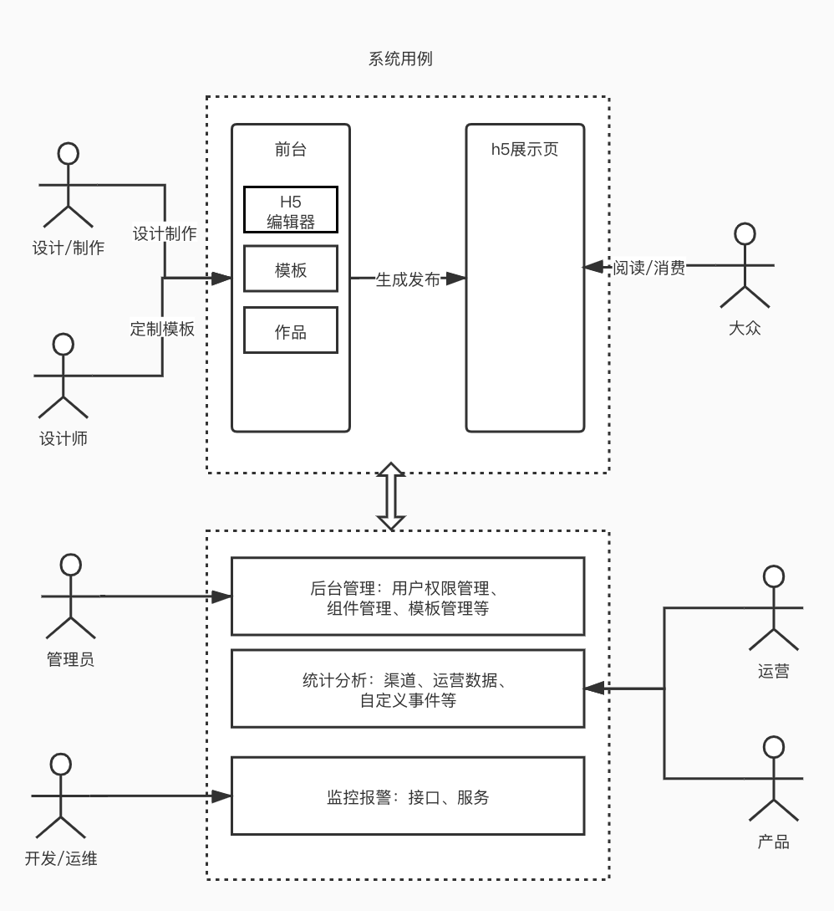
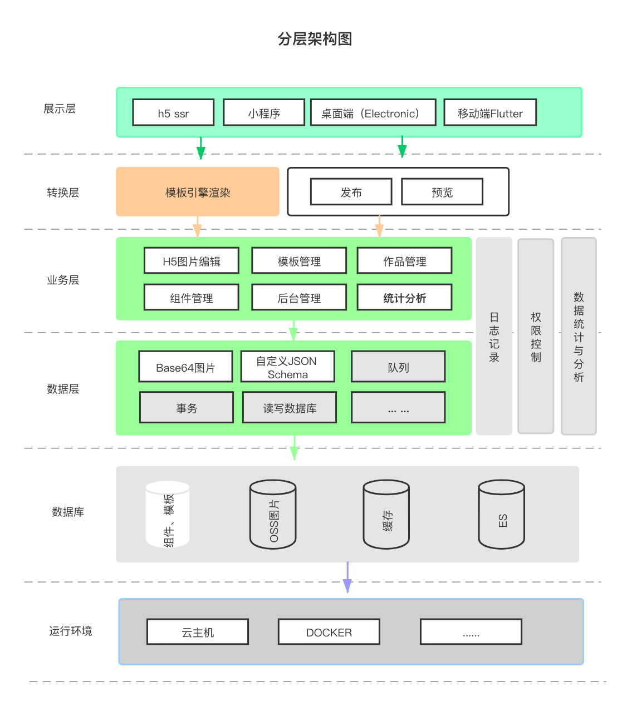

# 技术方案设计文档

# 需求

## 浅层需求
应用模板通过h5编辑器编辑生成自己的作品
## 深层需求
- 作品管理
- 作品统计
- 作品发布

# 范围

## 整体设计
用例

 
## 架构设计

## 模块设计
-  模块的拆分和关系图，结果
-  模块的关键功能，职责等
-  特殊的模块重点说明

# 组件库

# 作品的数据结构
vuex store
```
{
  work: {
    title: '作品标题',
    setting: {/* 一些可能的配置项，用不到就先预留 */},
    props: {/* 页面body的一些设置，如背景色 */},
    components: [
      // components要用数组，有序结构
      // 单个node要符合常见的vnode格式
      {
        id: 'xxx', // 每个组件都有id，不重复
        name: '文本1',
        tag: 'text',
        attrs: { fontSize: '20px' },
        children: [
          '文本1' // 文本内容，有时候放在children，有时候放在attrs或者props，没有标准，看实际情况来确定
        ]
      },
      {
        id: 'yyy',
        name: '图片1',
        tag: 'image',
        attrs: { src: 'xxx.png', width: '100px' },
        children: null
      }
    ]
  }
}
```
vuex getter

```
// 图层
{
  layers: (state) => {
    state.work.components.map(c => {
      return {
        id: c.id,
        name: c.name
      }
    })
  }
}
```


# 扩展性保证
## 扩展组件
## 素材类型扩展
- 图片
- SVG
- 动图
- 字体/艺术字体
- 动画
- 视频
## 数据结构层面
## 扩展编辑器功能
- 例如：组件隐藏、锁定、vnode
## 扩展页面的配置

# 开发提效


# 脚手架
- CICD 
- Git Flow工作流
- DOCKER容器部署/发布部署
# 组件平台

# 运维保障
- 线上服务和运维服务
- 安全
- 监控和报警
- 服务扩展性:QPS

# 总结
待补充
