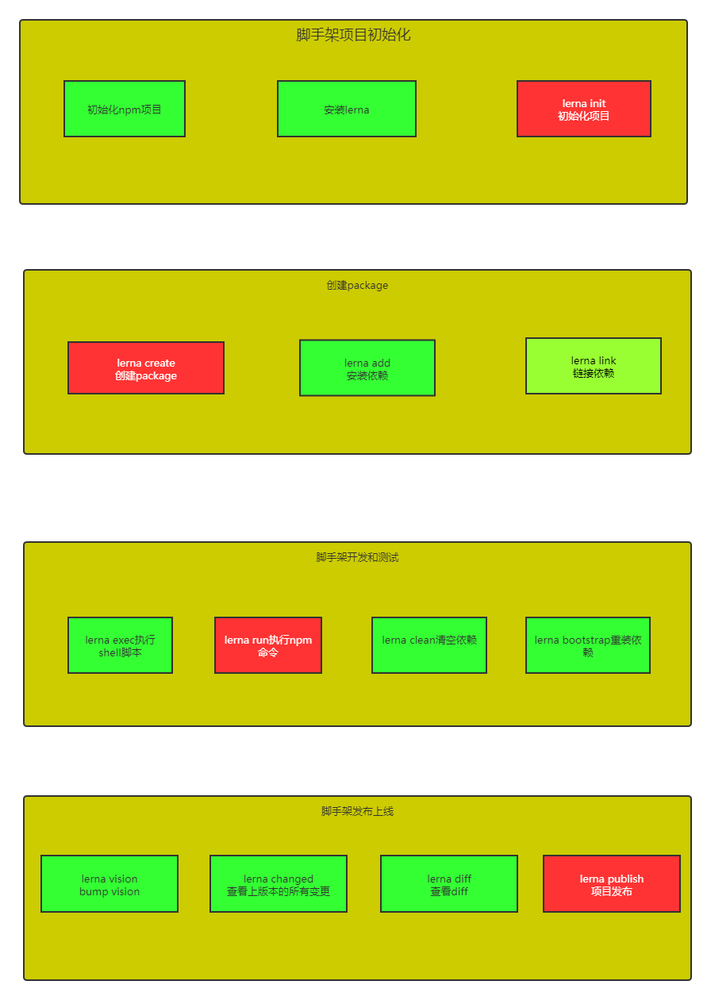

# 脚手架架构设计和框架搭建

## 站在前端研发的角度，分析开发脚手架的必要性 

### 脚手架核心价值是将研发过程
- 自动化：项目重复代码拷贝/git操作/发布上线操作
- 标准化：项目创建/git flow/发布流程/回滚流程
- 数据化：研发过程数据化、系统化，使得研发过程可量化

### 自研脚手架和自动化构建工具的区别
**市面上已经有了如Jenkins,travis等自动化构建工具，我们为什么还要自研脚手架？**
- 不满足需求：jenkins/travis通常需要在git hooks中触发，在服务端执行，无法覆盖研发人员本地的功能，如创建项目自动化，git操作自动化
- 定制复杂：jenkins/travis等工具的定制过程需要开发插件，要用到Java语言，对前端开发人员并不友好

## 从使用的角度来理解什么是脚手架

### 脚手架简介
其实脚手架的实质就是一个操作系统上的客户端。它通过命令行来执行，下面我们用一个常见的例子来举例： 
```javascript
vue create project
```
上面这条看似简单常见的命令实际上由3个部分组成： 
- 主命令：vue
- command：create
- command的param：project
这条命令大家应该都很常见了，它表示创建一个vue项目，项目的名字叫project。

### 脚手架执行原理


**脚手架执行原理如下**
- 在终端输入`vue create project`
- 终端解析出vue
- 在环境变量中找到vue命令
- 终端根据vue命令链接到实际文件vue.js
- 终端利用node执行vue.js
- vue.js解析command或者param
- vue.js执行command
- 执行完毕，退出执行
 
### 从应用的角度看 如何开发一个脚手架
1. 新建一个文件夹（项目）使用npm进行初始化，打开package.json 配置bin字段，创建一个命令，指向bin/index.js；
2. 将这个项目发布到npm； 
3. 全局安装这个脚手架；
4. 使用第一步中bin字段中配置的命令来使用脚手架即可。

## 脚手架开发流程详解

### 开发流程
1. 创建项目，使用npm初始化这个项目
2. 创建脚手架入口文件，第一行写如下代码：
```shell
#!/usr/bin/env node
```
3. 配置package.json文件，添加bin属性
4. 编写脚手架代码
5. 将脚手架发布到npm

### 使用流程
1. 安装脚手架：npm install -g imooc-test-erdan
2. 使用脚手架：imooc-test-erdan / imooc-test-erdan -h

### 把库发布到npm的流程
1. 打开[npm的官网](https://www.npmjs.com/),注册一个账号；
2. 打开邮箱，进行验证；
3. npm login 输入账号、密码和邮箱进行登录；
4. npm publish 将项目发布上去。

## 加深对npm link的使用和理解 

**新建&连接本地脚手架** 

```javascript
mkdir erdan-test
cd erdan-test
npm init -y
mkdir bin
cd bin
touch index.js
npm link
```
**新建本地库文件并在本地脚手架中使用**
```javascript
mkdir erdan-test-lib
npm init -y
npm link
cd erdan-test
npm link erdan-test-lib
```
**取消链接本地库文件**
```javascript
cd erdan-test-lib
npm unlink
cd erdan-test
# link存在的情况下执行下面这行
npm unlink erdan-test-lib
# link不存在的情况下删除node_modules
# 从安装发布到远程仓库上的库文件
npm i -S erdan-test-lib
```
## Lerna学习笔记

### lerna简介
我们在使用lerna之前，要知道我们为什么要用lerna，我们不妨看看原生开发脚手架存在什么痛点。 

**重复操作**
- 多package本地link
- 多package安装依赖
- 多package代码提交
- 多package单元测试
- 多package代码发布

**版本一致性**
- 发布时的版本一致性问题
- 发布后相互依赖版本升级问题

有了上面这些原生开发脚手架的痛点以后，就有了lerna这个优秀的工具。用一句话概述lerna就**是一个优化基于git+npm的多package项目的管理工具。**  

lerna的优势就是可以**大幅减少重复操作、提升操作的标准化。** 

lerna是架构优化的产物，lerna的产生揭示了一个架构真理：**项目复杂度提升以后，就需要对项目进行架构优化，架构优化的目的往往都是以效能为核心。**

### lerna开发脚手架流程图


### lerna实操
**使用lerna搭建脚手架框架**
```javascript
mkdir tangmen-cli-dev
npm init -y
npm install -g lerna (// 全局安装)
npm install lerna
lerna -v ( // 输出版本号说明安装成功)
lerna init (// 初始化lerna项目，会创建一个lerna.json)
// 经过上面init这一步，会初始化git仓库，再搞一个.gitignore 配置一些不用上传的目录
git remote xxx (// 添加远程仓库)
lerna create core (// 创建一个package)
lerna create utils(// 又创建了一个package)
lerna add (// 批量给两个package都安装依赖)
lerna publish (// 发布项目)
```

**lerna核心操作** 

初始化lerna
```javascript
lerna init
``` 
创建package 
```javascript
lerna create core
// 在这一步可以给package起一个别名 为了防止和npm上其它包重名 可以加个前缀@
// 这里要注意的是后面想成功发布这种带前缀的私包的话，需要先在npm上创建一个组织
// 举个栗子：如果你给这个包起的名字叫@tangmen-cli-dev/core  
// 那你先要建一个叫tangmen-cli-dev的组织
```  
安装依赖
```javascript
lerna add mocha --dev (// 给所有package都安装)
lerna add mocha package/core --dev (给core这个package安装依赖)
```  
清空依赖
```javascript
lerna clean
// 手动从package的package.json中删除依赖
```  
恢复依赖
```javascript
lerna bootstrap
```  
执行脚本
```javascript
lerna exec -- rm -rf node_modules (// 在所有package中都执行)
lerna exec --scope @tangmen-cli-dev/core --rm -rf node_modules (// 在特定package中执行脚本)
```  
执行 npm script 命令
```javascript
lerna run test (// 在所有package中都执行)
lerna run --scope  @tangmen-cli-dev/core test (// 在特定package中执行脚本)
```  
发布项目
```javascript
lerna publish
```  

## 学习使用lerna发布项目时候遇到的几个小坑
1. 有没有登录npm
2. tag重复问题
3. 加了@前缀的包默认是private的，要在package.json中改变一下publishConfig
4. 如果发布的是带前缀@的包，一定一定记得要先在npm上穿件一个group
5. package-lock.json不能添加在.gitignore中

## 作业

**已经发布到npm上的简易脚手架**
1. imooc-test-erdan
2. erdan-test-lib
3. @tangmen-cli-dev/core
4. @tangmen-cli-dev/utils

**PS:yargs和lerna源码分析的笔记打算另起一篇文章，这篇的篇幅着实有点长了~**